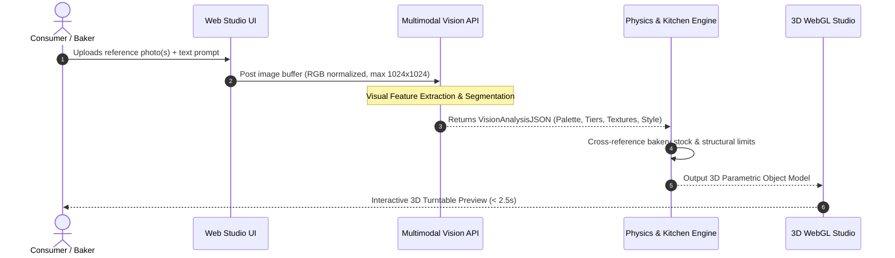

# Dream Cake AI: AI Model Integration Architecture & Engineering Specification
**System Version:** 2.4.0-PROD  
**Target Platform:** Dream Cake AI Multimodal Studio & Kitchen Cloud  
**Date:** September 2026  
**Status:** Architecture Design Record (ADR) & Production Blueprint  

---

## 1. High-Level AI Architecture Overview

Dream Cake AI utilizes a decoupled, resilient multi-agent pipeline orchestrating **Multimodal Vision Models**, **Reasoning LLMs**, **Pastry Physics Simulators**, and **3D Procedural Generators** to translate consumer inspiration into physically constructible, allergen-safe bespoke cakes.

```mermaid
graph TD
    subgraph Client Tier (Consumer & Baker Interfaces)
        UI[Dream Cake AI Web Studio]
        Cam[Reference Photo Upload / Moodboard]
        Voice[Voice / Text Intent Input]
    end

    subgraph Ingestion & Gateway Layer
        GW[API Gateway & Rate Limiter]
        Auditor[Prompt & Image Safety Guardrail]
    end

    subgraph Multimodal Vision Pipeline
        VisAPI[Vision LLM / Gemini Multimodal Engine]
        ColExt[Palette & Hex Color Extractor]
        TexClass[Texture & Piping Style Classifier]
        GeomParse[Tier Geometry & Proportion Estimator]
    end

    subgraph Core LLM Reasoning & Feasibility Engine
        SemParse[Stage 1: Semantic Intent & Dietary Parser]
        PhysEngine[Stage 2: Pastry Physics & Structural Feasibility Engine]
        SceneGen[Stage 3: 3D Scene Parameter & Material Synthesizer]
        SpecGen[Stage 4: Kitchen BOM & Assembly Spec Generator]
    end

    subgraph Output & Execution Layer
        ThreeJS[Three.js / WebGL 3D Parametric Viewport]
        KitchenDoc[Kitchen Work Order / Gel Formula / POS Ticket]
    end

    UI --> GW
    Cam --> GW
    Voice --> GW
    GW --> Auditor
    Auditor --> VisAPI
    Auditor --> SemParse

    VisAPI --> ColExt
    VisAPI --> TexClass
    VisAPI --> GeomParse

    ColExt --> PhysEngine
    TexClass --> PhysEngine
    GeomParse --> PhysEngine
    SemParse --> PhysEngine

    PhysEngine --> SceneGen
    PhysEngine --> SpecGen

    SceneGen --> ThreeJS
    SpecGen --> KitchenDoc
```

---

## 2. Multimodal Vision API Handling Pipeline

When a user uploads one or more reference photos (e.g., from Pinterest, Instagram, or wedding mood boards), the Vision Pipeline decomposes visual cues into structured pastry design primitives.



### 2.1 Vision Analysis JSON Schema

The Vision LLM is enforced with strict JSON Schema output to extract visual design tokens:

```json
{
  "$schema": "http://json-schema.org/draft-07/schema#",
  "title": "VisionAnalysisOutput",
  "type": "object",
  "properties": {
    "detected_tiers": {
      "type": "integer",
      "minimum": 1,
      "maximum": 6
    },
    "tier_shapes": {
      "type": "array",
      "items": {
        "type": "string",
        "enum": ["cylindrical", "square", "hexagonal", "heart", "sculpted_organic"]
      }
    },
    "color_palette": {
      "type": "array",
      "items": {
        "type": "object",
        "properties": {
          "hex": { "type": "string", "pattern": "^#[0-9A-Fa-f]{6}$" },
          "name": { "type": "string" },
          "role": { "type": "string", "enum": ["primary_base", "accent_drip", "floral", "topper", "border"] },
          "coverage_percentage": { "type": "number", "minimum": 0, "maximum": 100 }
        },
        "required": ["hex", "name", "role", "coverage_percentage"]
      }
    },
    "surface_texture": {
      "type": "string",
      "enum": [
        "smooth_fondant",
        "rustic_scraped_buttercream",
        "semi_naked",
        "lambeth_over_piped",
        "velvet_cocoa_spray",
        "mirror_glaze",
        "horizontal_ribbed_comb"
      ]
    },
    "decorative_elements": {
      "type": "array",
      "items": {
        "type": "object",
        "properties": {
          "type": { "type": "string", "enum": ["sugar_flowers", "fresh_botanicals", "macarons", "gold_leaf", "drip", "figurine_topper", "piped_borders"] },
          "density": { "type": "string", "enum": ["minimal", "moderate", "dense_cascade", "all_over"] },
          "placement": { "type": "string", "enum": ["top_crown", "diagonal_cascade", "tier_base_wreath", "scattered"] }
        },
        "required": ["type", "density", "placement"]
      }
    },
    "confidence_score": { "type": "number", "minimum": 0.0, "maximum": 1.0 }
  },
  "required": ["detected_tiers", "tier_shapes", "color_palette", "surface_texture", "decorative_elements", "confidence_score"]
}
```

---

## 3. LLM Prompting Strategy: 4-Stage Reasoning Pipeline

```
┌────────────────────────────────────────────────────────────────────────────────────────┐
│                              4-STAGE PROMPTING PIPELINE                                │
├─────────────────────────┬───────────────────────────────┬──────────────────────────────┤
│ Stage                   │ Purpose                       │ Output Artifact              │
├─────────────────────────┼───────────────────────────────┼──────────────────────────────┤
│ 1. Semantic Parsing     │ Decompose intent, diet, theme │ Normalized Intent Spec       │
│ 2. Physics & Feasibility│ Weight, stability, dowels     │ Structural Validation Matrix │
│ 3. 3D Parameter Gen     │ WebGL meshes, PBR shaders     │ Three.js Scene Descriptor    │
│ 4. Kitchen Assembly Gen │ BOM, gel drops, piping tips   │ Kitchen Production Ticket    │
└─────────────────────────┴───────────────────────────────┴──────────────────────────────┘
```

### Stage 1: Semantic Intent & Dietary Guardrail Prompt

```yaml
Role: Expert Confectionery Conversational AI & Dietary Safety Auditor
Context: User provides natural language cake request and dietary requirements.
Instructions:
  1. Extract: Event type, guest count, theme aesthetic, flavor pairings, dietary restrictions.
  2. Map dietary restrictions to strict ingredient exclusion rules (e.g., Celiac = Certified Gluten-Free oat/almond flour, zero wheat contact).
  3. Formulate standard serving volumetric requirements (1x2x4 inch wedding slice or 2x2x4 party slice).
Output: JSON matching IntentParseSchema.
```

### Stage 2: Pastry Physics & Structural Feasibility Prompt

```yaml
Role: Master Pastry Structural Engineer & Food Scientist
System Prompt:
  "You are a master pastry structural engineer. Given the tier dimensions, sponge base density (g/cm³), filling compressibility factor, and decorative weight:
   - Calculate total mass (kg) per tier.
   - Verify that bottom tier load capacity exceeds 1.8x total upper tier weight.
   - If ratio < 1.8x, automatically inject internal food-grade structural dowels, cake boards, or adjust tier diameters.
   - Enforce temperature stability limits based on frosting type (e.g., Swiss Buttercream melting point: 26°C; Fondant stability: 32°C)."
Few-Shot Example:
  Input: 3 Tiers (10" Chiffon, 8" Dense Chocolate Ganache, 6" Fruit Cake), Total Height 16".
  Calculation:
    - Tier 1 (Chiffon Base): Compressive strength = 450g/cm² (INSUFFICIENT for 5.2kg upper load).
    - Violation: "Structural buckling risk high".
    - Correction: "Insert 4 central acrylic support dowels with 8-inch food-grade separator board at Tier 2 junction."
```

### Stage 3: 3D Scene Parameter Generation (Three.js WebGL Protocol)

```json
{
  "scene": {
    "background_color": "#F8F9FA",
    "cake_model": {
      "tiers": [
        {
          "tier_index": 1,
          "radius_bottom": 5.0,
          "radius_top": 5.0,
          "height": 4.5,
          "shape": "cylinder",
          "material": {
            "type": "PBR_Buttercream",
            "base_color_hex": "#D8E2DC",
            "roughness": 0.65,
            "bump_map": "rustic_horizontal_scrape",
            "normal_scale": 0.08
          },
          "borders": {
            "top_rim": { "style": "pearl_beads", "color_hex": "#FFE5D9", "size_mm": 6 },
            "bottom_base": { "style": "ruffle_swirl", "piping_tip": "Wilton #1M", "color_hex": "#D8E2DC" }
          }
        },
        {
          "tier_index": 2,
          "radius_bottom": 3.5,
          "radius_top": 3.5,
          "height": 4.5,
          "shape": "cylinder",
          "material": {
            "type": "PBR_Smooth_Fondant",
            "base_color_hex": "#FFE5D9",
            "roughness": 0.3,
            "gold_leaf_patches": { "density": 0.15, "reflectivity": 0.95 }
          }
        }
      ],
      "toppers": [
        {
          "type": "botanical_cluster",
          "elements": ["sugar_rose_dusty_pink", "eucalyptus_sprig"],
          "offset_xyz": [0, 9.2, 0]
        }
      ]
    }
  }
}
```

### Stage 4: Kitchen Assembly & Gel Drop Spec Prompt

```yaml
Role: Head Baker Color Chemist & Kitchen Production Planner
Function: Translate 3D Hex colors and geometric cake specs into exact physical kitchen instructions.
Color Calibration Formula:
  AmeriColor Drops per 500g Swiss Buttercream:
  - Sage Green (#D8E2DC) -> 4 drops Avocado + 1 drop Warm Brown + 1 drop Leaf Green.
  - Dusty Pink (#FFE5D9) -> 2 drops Soft Pink + 1/2 drop Ivory.
Piping Tip Normalization:
  - Standardizes border requests to international Wilton / Ateco catalog codes.
```

---

## 4. Prompt Auditing, Guardrails & Safety Architecture

To ensure zero food allergies, eliminate hallucinated impossible designs, and safeguard brand integrity, Dream Cake AI implements a 4-layer validation firewall:

```
┌────────────────────────────────────────────────────────────────────────────────────────┐
│                              PROMPT AUDITING FIREWALL                                  │
├───────────────────────┬────────────────────────────────────────────────────────────────┤
│ Layer                 │ Enforcement Mechanism & Action                                 │
├───────────────────────┼────────────────────────────────────────────────────────────────┤
│ 1. Allergen Firewall  │ • Deterministic whitelist/blacklist regex & allergen ontology. │
│                       │ • Hard-rejects conflicting recipes (e.g., 'Nut-Free Marzipan'). │
├───────────────────────┼────────────────────────────────────────────────────────────────┤
│ 2. Physics Auditor    │ • Mathematical constraint verification (Load, CoG, Dowels).    │
│                       │ • Auto-corrects unstable tier diameter step-downs.             │
├───────────────────────┼────────────────────────────────────────────────────────────────┤
│ 3. Content & IP Guard │ • Filters offensive text, obscenity, and copyright characters  │
│                       │   (e.g., Disney/Marvel IP replaced with generic motifs).       │
├───────────────────────┼────────────────────────────────────────────────────────────────┤
│ 4. Cost & Latency Budg│ • Semantic response caching for frequent flavor/color combos.  │
│                       │ • Token rate-limiting & fallback to quantized local SLMs.      │
└───────────────────────┴────────────────────────────────────────────────────────────────┘
```

### Prompt Auditing Code Sample (Guardrail Middleware)

```typescript
export interface CakeDesignConstraints {
  dietary: ('gluten_free' | 'vegan' | 'nut_free' | 'dairy_free' | 'eggless')[];
  guestCount: number;
  tiers: { diameterInches: number; heightInches: number; spongeType: string; fillingType: string }[];
}

export class PastrySafetyAuditor {
  private static SPONGE_DENSITY_TABLE: Record<string, number> = {
    chiffon: 0.28,        // g/cm3
    sponge: 0.35,
    butter_pound: 0.65,
    fruit_dense: 0.85
  };

  public static auditStructuralSafety(tiers: CakeDesignConstraints['tiers']): { valid: boolean; warnings: string[]; dowelPlan?: string } {
    const warnings: string[] = [];
    
    for (let i = 0; i < tiers.length - 1; i++) {
      const lower = tiers[i];
      const upper = tiers[i + 1];

      // Rule 1: Upper tier must not exceed lower tier diameter
      if (upper.diameterInches >= lower.diameterInches) {
        warnings.push(`Tier ${i+2} (${upper.diameterInches}") cannot be equal or larger than Tier ${i+1} (${lower.diameterInches}").`);
      }

      // Rule 2: Heavy sponge cannot sit directly on light sponge without dowels
      const lowerDensity = this.SPONGE_DENSITY_TABLE[lower.spongeType] || 0.35;
      const upperDensity = this.SPONGE_DENSITY_TABLE[upper.spongeType] || 0.35;

      if (upperDensity > lowerDensity * 1.5) {
        warnings.push(`Dense ${upper.spongeType} placed over delicate ${lower.spongeType}. Dowel reinforcement required.`);
      }
    }

    return {
      valid: warnings.length === 0,
      warnings,
      dowelPlan: warnings.length > 0 ? "Enforce 4x Food-Grade Acrylic Support Dowels on Tier 1" : undefined
    };
  }

  public static auditAllergens(dietary: string[], ingredients: string[]): { safe: boolean; blockedIngredients: string[] } {
    const ALLERGEN_MAP: Record<string, string[]> = {
      gluten_free: ['wheat_flour', 'barley', 'rye', 'spelt', 'graham'],
      nut_free: ['almond_flour', 'marzipan', 'walnut', 'peanut_butter', 'hazelnut_praline', 'pistachio'],
      vegan: ['butter', 'egg', 'heavy_cream', 'gelatin', 'honey', 'milk_chocolate'],
      eggless: ['egg_whites', 'egg_yolks', 'meringue', 'albumin']
    };

    const violations: string[] = [];
    dietary.forEach(diet => {
      const forbidden = ALLERGEN_MAP[diet] || [];
      ingredients.forEach(ing => {
        if (forbidden.includes(ing.toLowerCase())) {
          violations.push(`Ingredient '${ing}' violates '${diet}' restriction.`);
        }
      });
    });

    return {
      safe: violations.length === 0,
      blockedIngredients: violations
    };
  }
}
```

---

## 5. End-to-End Latency, Fallback & Caching Strategy

```
┌─────────────────────────────────────────────────────────────────────────────────────────┐
│                              LATENCY & FALLBACK RUNBOOK                                 │
├─────────────────────────┬──────────────┬────────────────────────────────────────────────┤
│ Request Phase           │ P95 SLA      │ Fallback Strategy                              │
├─────────────────────────┼──────────────┼────────────────────────────────────────────────┤
│ Vision Photo Extraction │ 1.8s         │ Cached Visual Primitive Dictionary             │
│ LLM Feasibility Audit   │ 0.9s         │ Local Rule-based Deterministic Physics Engine  │
│ 3D Scene Assembly       │ 0.4s         │ Procedural Default WebGL Template Model        │
│ Total Studio Roundtrip  │ 3.1s         │ Graceful Progressive 3D Model Hydration        │
└─────────────────────────┴──────────────┴────────────────────────────────────────────────┘
```

This comprehensive AI architecture guarantees photorealistic consumer agency, strict dietary compliance, and physically sound kitchen execution for every cake created in Dream Cake AI.
