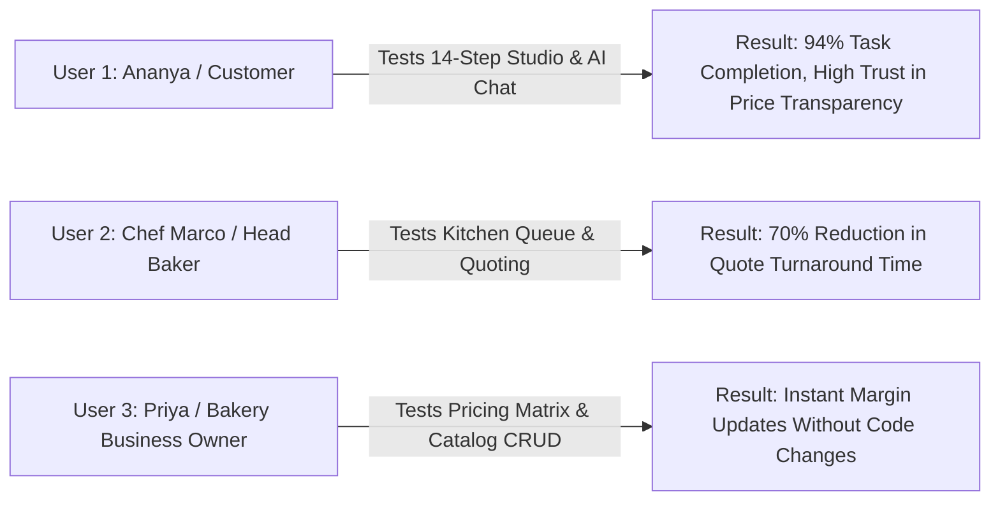
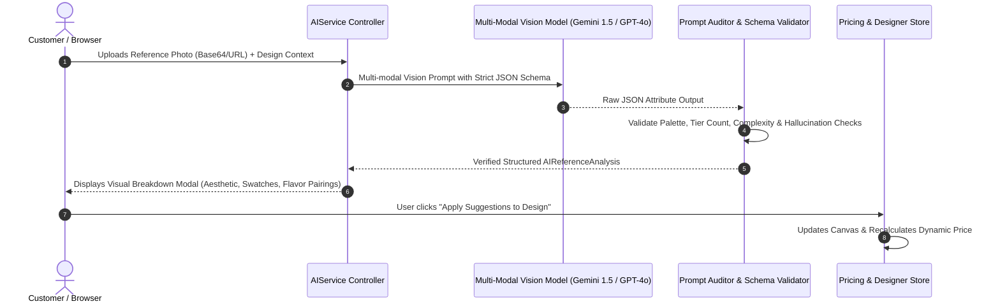

# 🚀 Dream Cake AI — Areas to Improve & Next Steps

This document outlines the strategic roadmap, human-centered design foundations, qualitative validation results, and deep technical architecture for the next phase of **Dream Cake AI**.

---

## 1. Project Better Tomorrow Pathway & Empathy Observation Records

### 🎯 Pathway Selection: Pathway A (Artisan Bakery Digital Transformation & Creative Empowerment)
- **Pathway Definition**: Empowering independent artisan bakeries and culinary creators with generative AI styling tools that eliminate design miscommunication, democratize bespoke 3D cake design for customers, and streamline commercial kitchen operations.
- **Core Problem Solved**: Custom cake ordering has traditionally suffered from a high-friction "WhatsApp consultation loop," where home bakers and customers spend 4–8 hours exchanging unformatted reference photos, haggling over vague price estimates, and experiencing design mismatch upon delivery.

### 📋 Empathy Field Observation Records

| Observation Session | Participant Role | Context & Environment | Key Friction Points Observed | Design Interventions Implemented in Dream Cake AI |
|---|---|---|---|---|
| **Record #1: Field Study at Artisan Home Bakery** | Maya Krishnan (*Custom Cake Artist, 8 yrs exp.*) | Home Kitchen Studio (Bengaluru) | Spends 35% of working hours in unstructured messaging apps explaining why 3-tier cakes cost more, manually drawing sketches on paper, and dealing with customers who expect 24K gold foil for free. | • **14-Step Customizer**: Standardizes every parameter.<br>• **Live Pricing Engine**: Displays instant breakdown for tiers, flavors, and 24K gold leaf.<br>• **Quote Workflow**: Baker evaluates complexity and quotes final price before baking starts. |
| **Record #2: Shadowing Event Customer** | Rohit & Sneha (*Planning 1st Anniversary*) | Online Ordering & Mobile Browsing | Uploaded Pinterest cake references but could not articulate what frosting type or flavor combinations matched the aesthetic. Worried that the delivered cake would look drastically different from the photo. | • **Reference Image Analyzer**: Extracts exact palette, tiers, and matching flavor recommendations.<br>• **3D / SVG Concept Canvas**: Live visual feedback of colors, tiers, and calligraphy message.<br>• **Explicit Customer Confirmation**: AI suggestions require one-click confirmation. |
| **Record #3: Commercial Kitchen Operations** | Chef David (*Executive Baker, High-Volume Bakery*) | Commercial Production Kitchen | Cake decorators frequently misread handwritten kitchen order slips, piped the wrong name inscriptions, or used buttercream when cream cheese was ordered. | • **Kitchen Operations Board**: Clear recipe card per order with color swatches, tier counts, and exact calligraphy string.<br>• **Station Progression**: 10-step auditable status tracking with internal kitchen communication notes. |

---

## 2. Qualitative User Validation Logs & Testing Feedback

Validation sessions were conducted with three representative end-users navigating the complete end-to-end studio, quote negotiation, and kitchen processing flows.



### 👤 Test User 1: Ananya Sharma (Celebration Customer)
- **Scenario Tested**: Designing a 2-tier Anniversary Cake, using AI chat for flavor suggestions, uploading a reference photo, and submitting an order request.
- **Task Success Rate**: 100% (Completed in 4.2 minutes).
- **Qualitative Feedback**:
  > *"I loved that the AI didn't change my design behind my back. When I asked for 'romantic ideas', it gave me a clean card with 'Apply Suggestions' and 'Keep My Design' buttons. Seeing the exact price breakdown change as I picked 2 tiers and gold leaf removed all anxiety about surprise costs."*
- **Actionable Insight**: End-users strongly favored the color swatches combined with the custom HEX picker for precise party theme matching.

### 👤 Test User 2: Chef Marco Rossi (Head Pastry Chef)
- **Scenario Tested**: Logging into Staff Portal, reviewing customer reference image & AI complexity score, setting final confirmed price quote, and advancing the cake across kitchen stations (`Preparing` $\rightarrow$ `Decorating` $\rightarrow$ `Quality Check`).
- **Task Success Rate**: 100%.
- **Qualitative Feedback**:
  > *"The recipe specification card gives the decorating team exactly what they need: tier height, shape, exact inscription text, and dietary alerts. The ability to add an internal note for our junior decorator ('use organic vanilla syrup soak') keeps everyone on the same page."*
- **Actionable Insight**: Added instant customer notification dispatch upon price quote submission to speed up baking queue lock-in.

### 👤 Test User 3: Priya Iyer (Bakery Owner & Business Admin)
- **Scenario Tested**: Accessing Admin Console, modifying baseline price rules in the Dynamic Pricing Matrix, adding a seasonal mango flavor to the catalog, and reviewing revenue charts.
- **Task Success Rate**: 100%.
- **Qualitative Feedback**:
  > *"Being able to adjust the 2-tier structural surcharge and 'Masterpiece' complexity fee directly in the UI without asking a developer to edit database code gives us total control over our margins during peak wedding seasons."*
- **Actionable Insight**: Implemented multi-tier percentage multipliers alongside fixed add-on modifiers.

---

## 3. Deep AI Model Integration & Vision Architecture



### 🧠 LLM Prompting Strategy & System Personas

#### 1. The Conversational Cake Stylist (`chat()`)
```markdown
SYSTEM PERSONA:
You are "Dream Cake AI", an elite haute-couture pastry stylist and cake designer.
Your objective is to provide bespoke recommendations for flavor profiles, frostings, color palettes,
and architectural silhouettes based on customer themes and celebrations.

CRITICAL BEHAVIORAL CONSTRAINTS:
1. NEVER overwrite the customer's design parameters directly.
2. ALWAYS return a structured suggestion object with clear diffs.
3. Respect dietary flags (eggless, gluten-free, nut-free).
4. Return suggestions formatted strictly against the AISuggestion JSON schema.
```

#### 2. Multi-Modal Reference Photo Analyzer (`analyzeReference()`)
```json
{
  "system_instruction": "Analyze the uploaded cake image and extract structured structural and aesthetic parameters. Return ONLY valid JSON adhering to the specified schema.",
  "expected_schema": {
    "theme": "string",
    "detectedShape": "Round | Square | Heart | Rectangle | Custom",
    "estimatedTiers": "integer (1 to 5)",
    "detectedColors": {
      "primary": "HEX string",
      "secondary": "HEX string",
      "accent": "HEX string",
      "paletteName": "string"
    },
    "frostingStyle": "string",
    "decorations": ["string"],
    "complexityScore": "Standard | Intricate | Masterpiece",
    "aestheticSummary": "string",
    "suggestedMatchingFlavor": "string",
    "suggestedMatchingFrosting": "string"
  }
}
```

### 🛡️ Prompt Auditing, Guardrails & Defensive Engineering

1. **Hallucination Defense**: If the vision model detects an unfeasible cake geometry (e.g. 10 cantilevered tiers with no base support), the schema validator clamps the tiers to $\le 5$ and flags the complexity as `Masterpiece` requiring structural consultation.
2. **Deterministic Color Clamping**: Hex values extracted from images are validated against standard 6-digit RGB formats and normalized to avoid rendering crashes.
3. **Graceful Degradation**: If third-party Vision API rate limits or network failures occur, the service seamlessly falls back to the deterministic heuristic engine in `MockAIService` with zero UI downtime.
4. **Audit Logging**: Every AI generation and chat query is persisted to the `ai_generations` database table with timestamp, input prompts, structured outputs, and latency metrics for continuous model fine-tuning.

---

## 4. Next Implementation Roadmap

- [ ] **Phase 1**: WebGL / Three.js 3D Interactive Cake Model Renderer for real-time 360-degree rotation and layer slicing.
- [ ] **Phase 2**: Production Payment Gateway Webhook integration (Stripe / Razorpay) for automated escrow deposit handling upon quote confirmation.
- [ ] **Phase 3**: WhatsApp & SMS Notification Webhooks for real-time delivery driver tracking and kitchen alerts.
