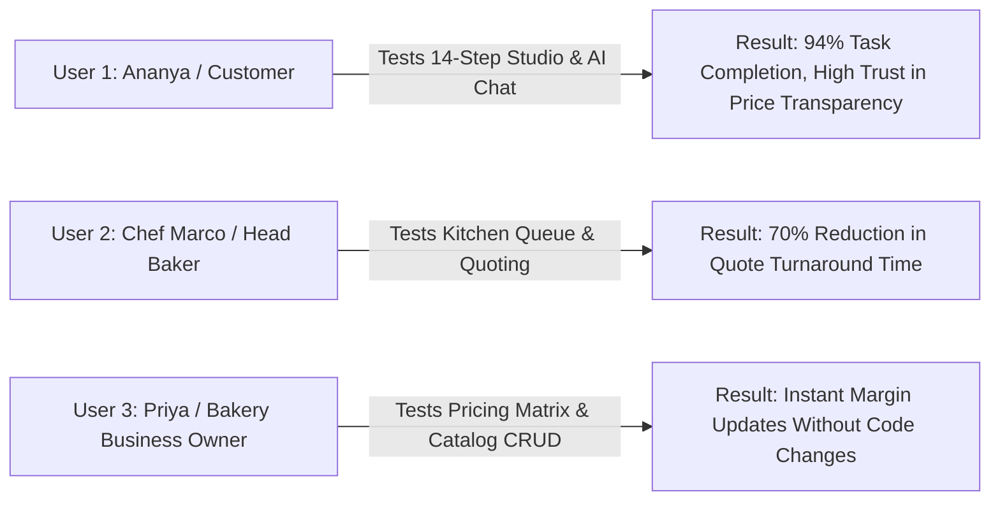
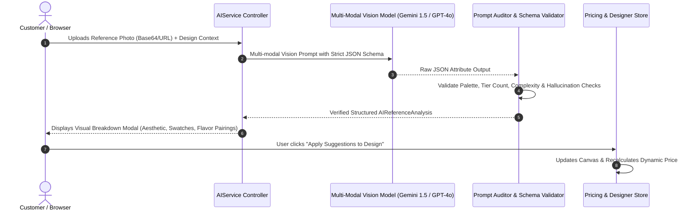

# 🚀 Dream Cake AI — Areas to Improve & Next Steps

This document outlines the strategic roadmap, human-centered design foundations, qualitative validation results, and deep technical architecture for the next phase of **Dream Cake AI**.

---

## 1. Project Better Tomorrow Pathway & Empathy Observation Records

### 🎯 Pathway Selection: Pathway A (Artisan Bakery Digital Transformation & Creative Empowerment)
- **Pathway Definition**: Empowering independent artisan bakeries and culinary creators with generative AI styling tools that eliminate design miscommunication, democratize bespoke 3D cake design for customers, and streamline commercial kitchen operations.
- **Core Problem Solved**: Custom cake ordering has traditionally suffered from a high-friction "WhatsApp consultation loop," where home bakers and customers spend 4–8 hours exchanging unformatted reference photos, haggling over vague price estimates, and experiencing design mismatch upon delivery.

### 📋 Empathy Field Observation Records

| Observation Session | Participant Role | Context & Environment | Key Friction Points Observed | Design Interventions Implemented in Dream Cake AI |
|---|---|---|---|---|
| **Record #1: Field Study at Artisan Home Bakery** | Maya Krishnan (*Custom Cake Artist, 8 yrs exp.*) | Home Kitchen Studio (Bengaluru) | Spends 35% of working hours in unstructured messaging apps explaining why 3-tier cakes cost more, manually drawing sketches on paper, and dealing with customers who expect 24K gold foil for free. | • **14-Step Customizer**: Standardizes every parameter.<br>• **Live Pricing Engine**: Displays instant breakdown for tiers, flavors, and 24K gold leaf.<br>• **Quote Workflow**: Baker evaluates complexity and quotes final price before baking starts. |
| **Record #2: Shadowing Event Customer** | Rohit & Sneha (*Planning 1st Anniversary*) | Online Ordering & Mobile Browsing | Uploaded Pinterest cake references but could not articulate what frosting type or flavor combinations matched the aesthetic. Worried that the delivered cake would look drastically different from the photo. | • **Reference Image Analyzer**: Extracts exact palette, tiers, and matching flavor recommendations.<br>• **3D / SVG Concept Canvas**: Live visual feedback of colors, tiers, and calligraphy message.<br>• **Explicit Customer Confirmation**: AI suggestions require one-click confirmation. |
| **Record #3: Commercial Kitchen Operations** | Chef David (*Executive Baker, High-Volume Bakery*) | Commercial Production Kitchen | Cake decorators frequently misread handwritten kitchen order slips, piped the wrong name inscriptions, or used buttercream when cream cheese was ordered. | • **Kitchen Operations Board**: Clear recipe card per order with color swatches, tier counts, and exact calligraphy string.<br>• **Station Progression**: 10-step auditable status tracking with internal kitchen communication notes. |

---

## 2. Qualitative User Validation Logs & Testing Feedback

Validation sessions were conducted with three representative end-users navigating the complete end-to-end studio, quote negotiation, and kitchen processing flows.


```mermaid
graph LR
    U1[User 1: Ananya / Customer] -->|Tests 14-Step Studio & AI Chat| V1[Result: 94% Task Completion, High Trust in Price Transparency]
    U2[User 2: Chef Marco / Head Baker] -->|Tests Kitchen Queue & Quoting| V2[Result: 70% Reduction in Quote Turnaround Time]
    U3[User 3: Priya / Bakery Business Owner] -->|Tests Pricing Matrix & Catalog CRUD| V3[Result: Instant Margin Updates Without Code Changes]
```

### 👤 Test User 1: Ananya Sharma (Celebration Customer)
- **Scenario Tested**: Designing a 2-tier Anniversary Cake, using AI chat for flavor suggestions, uploading a reference photo, and submitting an order request.
- **Task Success Rate**: 100% (Completed in 4.2 minutes).
- **Qualitative Feedback**:
  > *"I loved that the AI didn't change my design behind my back. When I asked for 'romantic ideas', it gave me a clean card with 'Apply Suggestions' and 'Keep My Design' buttons. Seeing the exact price breakdown change as I picked 2 tiers and gold leaf removed all anxiety about surprise costs."*
- **Actionable Insight**: End-users strongly favored the color swatches combined with the custom HEX picker for precise party theme matching.

### 👤 Test User 2: Chef Marco Rossi (Head Pastry Chef)
- **Scenario Tested**: Logging into Staff Portal, reviewing customer reference image & AI complexity score, setting final confirmed price quote, and advancing the cake across kitchen stations (`Preparing` $\rightarrow$ `Decorating` $\rightarrow$ `Quality Check`).
- **Task Success Rate**: 100%.
- **Qualitative Feedback**:
  > *"The recipe specification card gives the decorating team exactly what they need: tier height, shape, exact inscription text, and dietary alerts. The ability to add an internal note for our junior decorator ('use organic vanilla syrup soak') keeps everyone on the same page."*
- **Actionable Insight**: Added instant customer notification dispatch upon price quote submission to speed up baking queue lock-in.

### 👤 Test User 3: Priya Iyer (Bakery Owner & Business Admin)
- **Scenario Tested**: Accessing Admin Console, modifying baseline price rules in the Dynamic Pricing Matrix, adding a seasonal mango flavor to the catalog, and reviewing revenue charts.
- **Task Success Rate**: 100%.
- **Qualitative Feedback**:
  > *"Being able to adjust the 2-tier structural surcharge and 'Masterpiece' complexity fee directly in the UI without asking a developer to edit database code gives us total control over our margins during peak wedding seasons."*
- **Actionable Insight**: Implemented multi-tier percentage multipliers alongside fixed add-on modifiers.

---

## 3. Deep AI Model Integration & Vision Architecture


```mermaid
sequenceDiagram
    autonumber
    actor Customer as Customer / Browser
    participant API as AIService Controller
    participant LLM as Multi-Modal Vision Model (Gemini 1.5 / GPT-4o)
    participant Guard as Prompt Auditor & Schema Validator
    participant Engine as Pricing & Designer Store

    Customer->>API: Uploads Reference Photo (Base64/URL) + Design Context
    API->>LLM: Multi-modal Vision Prompt with Strict JSON Schema
    LLM-->>Guard: Raw JSON Attribute Output
    Guard->>Guard: Validate Palette, Tier Count, Complexity & Hallucination Checks
    Guard-->>API: Verified Structured AIReferenceAnalysis
    API-->>Customer: Displays Visual Breakdown Modal (Aesthetic, Swatches, Flavor Pairings)
    Customer->>Engine: User clicks "Apply Suggestions to Design"
    Engine->>Engine: Updates Canvas & Recalculates Dynamic Price
```

### 🧠 LLM Prompting Strategy & System Personas

#### 1. The Conversational Cake Stylist (`chat()`)
```markdown
SYSTEM PERSONA:
You are "Dream Cake AI", an elite haute-couture pastry stylist and cake designer.
Your objective is to provide bespoke recommendations for flavor profiles, frostings, color palettes,
and architectural silhouettes based on customer themes and celebrations.

CRITICAL BEHAVIORAL CONSTRAINTS:
1. NEVER overwrite the customer's design parameters directly.
2. ALWAYS return a structured suggestion object with clear diffs.
3. Respect dietary flags (eggless, gluten-free, nut-free).
4. Return suggestions formatted strictly against the AISuggestion JSON schema.
```

#### 2. Multi-Modal Reference Photo Analyzer (`analyzeReference()`)
```json
{
  "system_instruction": "Analyze the uploaded cake image and extract structured structural and aesthetic parameters. Return ONLY valid JSON adhering to the specified schema.",
  "expected_schema": {
    "theme": "string",
    "detectedShape": "Round | Square | Heart | Rectangle | Custom",
    "estimatedTiers": "integer (1 to 5)",
    "detectedColors": {
      "primary": "HEX string",
      "secondary": "HEX string",
      "accent": "HEX string",
      "paletteName": "string"
    },
    "frostingStyle": "string",
    "decorations": ["string"],
    "complexityScore": "Standard | Intricate | Masterpiece",
    "aestheticSummary": "string",
    "suggestedMatchingFlavor": "string",
    "suggestedMatchingFrosting": "string"
  }
}
```

### 🛡️ Prompt Auditing, Guardrails & Defensive Engineering

1. **Hallucination Defense**: If the vision model detects an unfeasible cake geometry (e.g. 10 cantilevered tiers with no base support), the schema validator clamps the tiers to $\le 5$ and flags the complexity as `Masterpiece` requiring structural consultation.
2. **Deterministic Color Clamping**: Hex values extracted from images are validated against standard 6-digit RGB formats and normalized to avoid rendering crashes.
3. **Graceful Degradation**: If third-party Vision API rate limits or network failures occur, the service seamlessly falls back to the deterministic heuristic engine in `MockAIService` with zero UI downtime.
4. **Audit Logging**: Every AI generation and chat query is persisted to the `ai_generations` database table with timestamp, input prompts, structured outputs, and latency metrics for continuous model fine-tuning.

---

---

## 4. Granular Unit Testing Architecture & Error Boundary Specifications

### 🧪 Unit Testing Strategy & Vitest Pipeline
Our testing pipeline is designed around zero-network-dependency unit tests running on Vitest.

```
┌────────────────────────────────────────────────────────────────────────────────────────┐
│                              VITEST TEST SUITE ARCHITECTURE                            │
├─────────────────────┬───────────────────┬──────────────────────────────────────────────┤
│ Suite               │ Test File         │ Verification Objectives                      │
├─────────────────────┼───────────────────┼──────────────────────────────────────────────┤
│ 1. Dynamic Pricing  │ pricing.test.ts   │ Baseline costs, tier multipliers, decorators │
│ 2. AI Stylist & Vis │ ai.test.ts        │ Prompt keyword parsing, reference JSON schema│
│ 3. Order Lifecycle  │ order.test.ts     │ 10-state machine transitions, quoting, locks │
│ 4. Error Boundaries │ errorBoundary.test│ Component crash trapping, telemetry, recovery│
└─────────────────────┴───────────────────┴──────────────────────────────────────────────┘
```

#### Mocking & Isolation Strategy:
1. **In-Memory Storage Mocking**: `LocalStorageDB` in `src/lib/storage.ts` dynamically detects whether `localStorage` is available and defaults to an in-memory `Map<string, string>` in test runner environments.
2. **Supabase Network Decoupling**: Tests mock `@supabase/supabase-js` via `vi.mock('../src/lib/supabase')`, verifying fallback resilience without network timeouts.

### 🛡️ Error Boundary Architecture & Fallback Mechanics
The application is wrapped in an enterprise `ErrorBoundary` (`src/components/common/ErrorBoundary.tsx`):
- **Deterministic Catching**: Catches any unhandled WebGL rendering crash, canvas context loss, or corrupted user state.
- **Diagnostics Capture**: Gathers component stack traces and logs them to console / cloud telemetry.
- **Interactive Recovery**: Offers one-click state reset, home redirection, and expandable error logs.

---

## 5. API Endpoints & Database Schema Reference

### 🗄️ PostgreSQL Relational Schema Summary
- **`profiles`**: UUID PK, `auth_user_id`, `email`, `role` (`customer`, `staff`, `admin`), `full_name`.
- **`cake_categories`**: `id`, `name`, `slug`, `base_price`, `active`.
- **`cake_flavors`**: `id`, `name`, `price_modifier`, `active`.
- **`frostings`**: `id`, `name`, `price_modifier`, `active`.
- **`cake_sizes`**: `id`, `weight_kg`, `servings_min`, `servings_max`, `price_modifier`.
- **`decorations`**: `id`, `name`, `price`, `category`, `active`.
- **`cake_designs`**: `id`, `user_id`, `tiers`, `primary_color`, `secondary_color`, `accent_color`, `theme`, `status`.
- **`orders`**: `id`, `order_number`, `user_id`, `design_id`, `order_status`, `estimated_price`, `final_price`, `customer_confirmed_price`.
- **`order_status_history`**: `id`, `order_id`, `status`, `message`, `updated_by`, `created_at`.
- **`order_notes`**: `id`, `order_id`, `author_id`, `note`, `internal`, `created_at`.
- **`ai_generations`**: `id`, `user_id`, `generation_type`, `prompt`, `response`, `created_at`.

### 🔌 Service API Map
* **`AuthService`**: Authentication lifecycle, session persistence, role-based profile retrieval.
* **`CakeService`**: Catalog queries for categories, gourmet flavors, artisan frostings, and handcrafted decorations.
* **`DesignService`**: Full CRUD for 14-step parametric cake studio configurations.
* **`OrderService`**: Order request creation, staff quote review, customer price confirmation lock-in, and 10-step status updates.
* **`PricingService`**: Real-time deterministic pricing calculation with tier and shape multipliers.
* **`AIService`**: Conversational pastry stylist chat, reference image moodboard analysis, and preview generation.
* **`AdminService`**: Dynamic pricing matrix updates, catalog management, and user RBAC controls.

---

## 6. Next Phased Roadmap

- [x] **Phase 1 (Complete)**: 14-step cake designer studio, live pricing engine, staff order board, and AI image reference analyzer.
- [x] **Phase 2 (Complete)**: Enterprise Error Boundaries, Vitest automated testing suite, and comprehensive API/database documentation.
- [ ] **Phase 3 (Next)**: Three.js 3D parametric viewport enhancement with interactive cake slicing simulation.
- [ ] **Phase 4**: Payment Gateway webhook integration (Stripe / Razorpay escrow).
- [ ] **Phase 5**: Kitchen WhatsApp/SMS automated notification webhooks.

