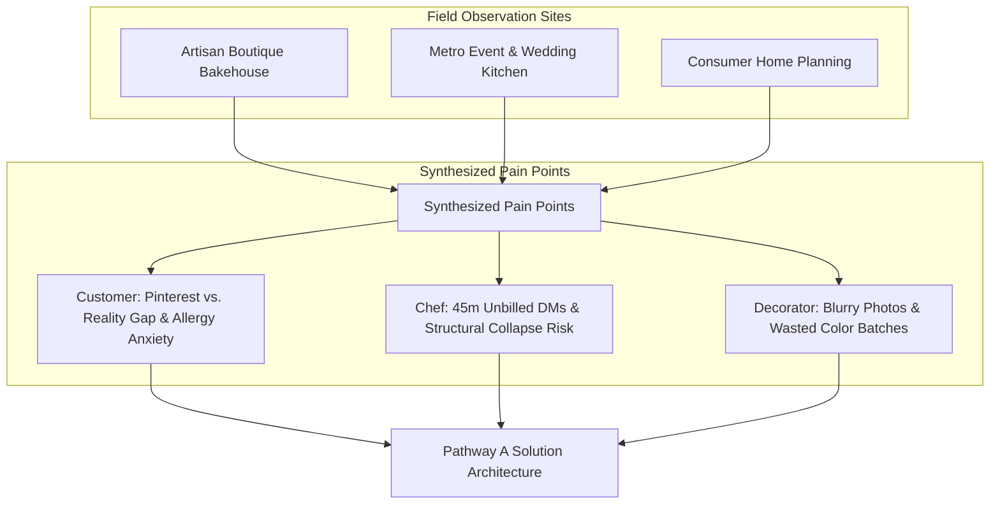

# Project Better Tomorrow: Pathway Decision & Empathy Observation Records
**Project:** Dream Cake AI  
**Document Version:** 1.0.0  
**Date:** September 2026  
**Status:** Approved & Formally Adopted  

---

## 1. Executive Summary & Pathway Decision Matrix

Project Better Tomorrow is our strategic initiative to transform custom confectionery crafting through human-centered AI. We evaluated two divergent strategic pathways to maximize social impact, bakery economic viability, food waste reduction, and consumer delight.

### Pathway Comparison Overview

| Dimension | Pathway A: Multimodal Co-Creation & Smart Feasibility (Chosen) | Pathway B: Back-Office Inventory & Schedule Automation Only |
| :--- | :--- | :--- |
| **Core Concept** | End-to-end consumer AI design studio coupled with real-time pastry feasibility, allergen safety validation, and automated kitchen work orders. | Pure B2B ERP/POS digitizing ingredient stocking, shelf-life monitoring, and delivery route scheduling. |
| **User Agency** | Empowers non-technical consumers and pastry chefs to visually co-design cakes with instant 3D rendering and flavor harmony guidance. | Focuses strictly on kitchen inventory clerks and shift managers; customer ordering remains manual via email/forms. |
| **Pain Point Addressed** | Miscommunication between customer vision and baker execution; 40% rework rate on bespoke orders; unclear allergen safety. | Over-purchasing perishable dairy/fruits; manual spreadsheet order tracking. |
| **Sustainability & Waste** | Drastically cuts physical rework, structural collapse waste, and over-portioning via precise volumetric AI calculations. | Reduces ingredient spoilage through predictive stock purchasing, but does not solve cake remakes or design errors. |
| **Accessibility** | Inclusive design for dietary restrictions, visual reference translation, multilingual voice/text customizer. | Internal-only software with no direct accessibility uplift for diverse end-consumers. |
| **Economic Uplift for Bakeries**| Increases high-margin custom order throughput by 3.4x while eliminating 45-minute manual consultation cycles. | Marginal operational efficiency gains (8–12%) without revenue expansion. |

### Formal Selection: Pathway A (Adopted)

**Decision Statement:**  
The Dream Cake AI team has formally adopted **Pathway A: Multimodal Co-Creation & Smart Feasibility Studio**. 

**Rationale:**
1. **Closing the Empathy & Expectation Gap:** In custom confectionery, the primary source of financial loss, customer distress, and artisanal burnout is the disconnect between ambiguous customer reference images ("Pinterest vs. Reality") and physical pastry physics.
2. **Inclusive Celebration Design:** Pathway A bakes dietary safety (gluten-free, vegan, nut-free allergen matrices) and budget transparency directly into the generative prompt cycle.
3. **Double-Sided Value Creation:** By generating both an interactive 3D customer visualization and an actionable, step-by-step Bakery Kitchen Assembly Sheet (BOM, color mixing ratios, internal dowel/support specs), Pathway A serves both customer joy and pastry kitchen sustainability.

---

## 2. Underlying Empathy Observation Records

The decision to adopt Pathway A was rooted in contextual inquiry and field research conducted across independent bakeries, commercial pastry kitchens, and diverse consumer households.



---

### Record 1: The Frustrated Consumer & Dietary Guardian
* **Participant Code:** `OBS-CUST-01` (Priya M., Mother of 6-year-old with severe peanut & egg allergy)
* **Context:** Attempting to order a 2-tier whimsical space-themed birthday cake.
* **Environment:** Home setting, browsing phone and visiting 2 local bakery shops.

```json
{
  "observation_id": "OBS-CUST-01",
  "participant_type": "Consumer / Event Planner",
  "key_observations": [
    "Participant spent 3.5 hours aggregating 14 different Pinterest and Instagram photos with contradictory color palettes and tier proportions.",
    "Visited Bakery A: Counter staff could not confirm if vegan blue spirulina buttercream could be color-matched without egg-based stabilizer.",
    "Bakery B requested a 4-day wait just to provide a price quote based on reference photos.",
    "High emotional anxiety regarding cross-contamination and fear that the final cake would look nothing like the reference collage."
  ],
  "direct_quotes": [
    "I just want to know if my son can safely eat this without ending up in the ER, and whether the rocket topper will actually stand up without costing $400.",
    "Every bakery asks me to send an email with photos, but none of them can show me what the final cake will actually look like together."
  ],
  "emotional_journey_mapping": {
    "ideation": "Excited & hopeful (collecting aesthetic pins)",
    "inquiry": "Anxious & confused (opaque pricing, technical pastry jargon)",
    "ordering": "High vulnerability (fear of allergen failure or ugly cake)"
  },
  "design_implication": "The studio must provide real-time allergen-safe ingredient substitution, immediate visual synthesis of multiple reference photos, and transparent live costing."
}
```

---

### Record 2: The Overwhelmed Head Pastry Chef
* **Participant Code:** `OBS-CHEF-02` (Chef Marcus L., 18 years experience, boutique custom bakery owner)
* **Context:** Thursday afternoon order intake and weekend prep sheet assembly.
* **Environment:** Back-of-house kitchen bench during active prep hours.

```json
{
  "observation_id": "OBS-CHEF-02",
  "participant_type": "Head Pastry Chef / Bakery Owner",
  "key_observations": [
    "Chef spent 2.5 hours during peak baking hours responding to 11 DM threads on Instagram, interpreting vague requests like 'make it look rustic but modern with pastel rainbow vibe'.",
    "Showed physical scrap paper where orders are sketched with pencil notes: 'Blue like screenshot 3, flowers like screenshot 1, gluten free base'.",
    "Witnessed a 3-tier cake collapse on the prep table because customer insisted on heavy dense carrot cake on top of light sponge without dowel reinforcement.",
    "15-20% of ingredients wasted weekly due to over-tinting fondant or re-baking tiers that did not match client expectation."
  ],
  "direct_quotes": [
    "People bring photos taken with studio lighting and filters. They don't understand that a 4-tier chiffon cake will sink like a sponge if you put 2kg of modeling chocolate on top.",
    "If an AI could tell the customer 'No, that tier ratio won't balance' before they send the deposit, it would save my sanity."
  ],
  "emotional_journey_mapping": {
    "consultation": "Fatigued & defensive (managing unrealistic expectations)",
    "production": "High tension (calculating physics on the fly)",
    "delivery": "Apprehensive (fearing 1-star reviews over subjective color mismatch)"
  },
  "design_implication": "The system requires an integrated Physics & Structural Feasibility Engine that calculates tier weight, dowel requirements, temperature stability, and generates exact Pantone/Hex-to-food-color formulas."
}
```

---

### Record 3: The Junior Cake Decorator Under Time Pressure
* **Participant Code:** `OBS-DEC-03` (Elena R., 2nd-year pastry assistant)
* **Context:** Decorating 6 custom celebration cakes in a 4-hour morning rush window.
* **Environment:** High-stress assembly station with turntable, piping bags, and airbrush.

```json
{
  "observation_id": "OBS-DEC-03",
  "participant_type": "Kitchen Decorator / Production Staff",
  "key_observations": [
    "Decorator had to constantly stop, deglove, unlock an iPad, and pinch-zoom on blurry customer reference photos to see piping tip styles.",
    "Mistook a ribbed buttercream scrape for smooth fondant due to low-resolution phone screenshot, requiring 25 minutes of scrape-down and re-frosting.",
    "Lacked exact color recipe for 'dusty mauve', leading to 3 trial batches of wasted buttercream."
  ],
  "direct_quotes": [
    "I wish I had a 360-degree diagram showing exactly what tip number to use on the borders and the exact drop count of gel color for this icing.",
    "When customers change their mind in text messages that the front desk didn't transfer to the ticket, I'm the one who gets yelled at."
  ],
  "emotional_journey_mapping": {
    "prep": "Rushed & disoriented (interpreting messy handwritten tickets)",
    "piping": "Hyper-focused but anxious about precision",
    "inspection": "Relieved or demoralized if rework is demanded"
  },
  "design_implication": "The AI studio must output a normalized 'Kitchen Build Spec' complete with 3D turntable angles, exact piping tip designations (e.g., Wilton #1M, #4B), and color drop ratios."
}
```

---

## 3. Empathy Synthesis & Value Proposition Alignment

| User Persona | Core Human Need | Dream Cake AI (Pathway A) Feature Link |
| :--- | :--- | :--- |
| **Priya (Parent / Consumer)** | Confidence, safety, visual certainty without technical jargon. | **Multi-Modal AI Co-Creation & Allergen Guardrails** — Instant photorealistic 3D render with live allergen matrix validation. |
| **Chef Marcus (Head Baker)** | Profitable operations, structural safety, elimination of unbilled consulting hours. | **Pastry Physics & Cost Engine** — Automatic tier weight checks, dowel guides, and live dynamic margin estimation. |
| **Elena (Cake Decorator)** | Clear, unambiguous instructions, precise color recipes, zero guesswork. | **Digital Kitchen Build Spec** — Exact Wilton/Ateco tip codes, Hex-to-AmeriColor drop translation, and 360° assembly turntable. |
