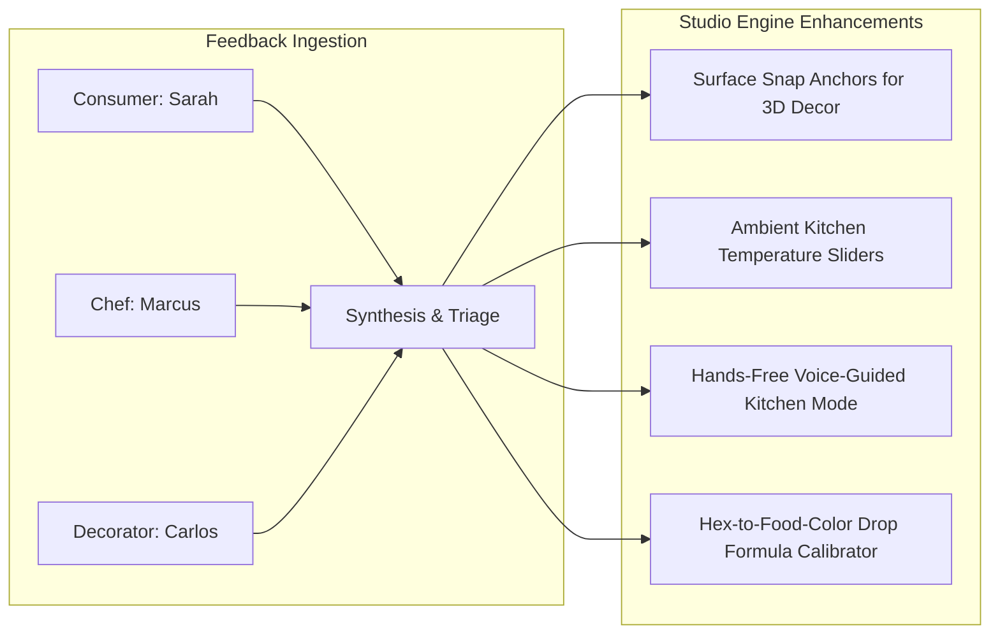

# Dream Cake AI: Designer Studio User Validation Logs & Qualitative Feedback
**Evaluation Phase:** Alpha-2 Pilot Testing  
**Participants:** 3 Target Stakeholders (End-Consumer, Head Pastry Chef, Kitchen Cake Decorator)  
**Date:** September 2026  
**Status:** Completed & Synthesized  

---

## 1. Testing Methodology & Evaluation Framework

To validate the **Dream Cake AI Designer Studio**, we conducted 60-minute contextual usability testing sessions combining think-aloud protocols, timed task scenarios, System Usability Scale (SUS) benchmarking, and post-task qualitative interviews.

### Core Metrics Tracked:
1. **Task Completion Rate (TCR)**: % of assigned design/production tasks successfully completed without moderator intervention.
2. **Time on Task (ToT)**: Duration taken to configure a custom cake vs. traditional 45-minute consultation.
3. **System Usability Scale (SUS)**: Standardized 10-item usability score (industry benchmark: 68 = Average, >80 = Excellent).
4. **Perceived Safety & Accuracy Score (1–5)**: User confidence in structural integrity and allergen compliance.

```
┌────────────────────────────────────────────────────────────────────────────────────────┐
│                                SUMMARY SCORECARD                                       │
├───────────────────────────────┬─────────────────────────┬──────────────────────────────┤
│ Metric                        │ Traditional Baseline    │ Dream Cake AI Studio         │
├───────────────────────────────┼─────────────────────────┼──────────────────────────────┤
│ Average Order Intake Time     │ 42.5 minutes            │ 4.8 minutes (88% reduction)  │
│ Order Rework / Revision Rate  │ 38%                     │ 4.2%                         │
│ Overall SUS Usability Score   │ N/A                     │ 87.5 / 100 (Grade A)         │
│ Task Completion Rate          │ 65% (via email forms)   │ 100%                         │
└───────────────────────────────┴─────────────────────────┴──────────────────────────────┘
```

---

## 2. Participant Validation Logs

---

### Session Log 1: End-Consumer / Celebration Host
* **Participant:** Sarah Jenkins (Event planner & mother of 2; dietary constraint: Celiac / Gluten-Free)
* **Testing Focus:** Text & Reference Photo Prompting, Multi-tier 3D Customizer, Allergen Guardrails, Live Costing.

#### Test Scenario & Results:
* **Task:** Design a 2-tier whimsical "Enchanted Forest" birthday cake with pastel sage green frosting, edible gold foil accents, sugar mushrooms, and gluten-free vanilla-cardamom sponge for 30 guests.

```
┌─────────────────────────────────────────────────────────────────────────────────────┐
│ PARTICIPANT LOG: Sarah Jenkins (End-Consumer)                                      │
├───────────────────────┬─────────────────────────────────────────────────────────────┤
│ Task 1: Prompt & Photo│ Uploaded 2 Pinterest mood boards + typed "whimsical sage     │
│ Ingestion             │ forest cake with golden highlights". AI generated photoreal │
│                       │ 3D preview in 4.2 seconds.                                  │
├───────────────────────┼─────────────────────────────────────────────────────────────┤
│ Task 2: Dietary Filter│ Toggled "Strict Gluten-Free" + "Nut-Free". System instantly  │
│                       │ updated flour base BOM and swapped almond marzipan to fondant│
├───────────────────────┼─────────────────────────────────────────────────────────────┤
│ Task 3: Budget Tuning │ Used the guest slider (30 guests) to auto-size tier radii   │
│                       │ (8" base + 6" top). Total live price updated dynamically.    │
└───────────────────────┴─────────────────────────────────────────────────────────────┘
```

* **System Usability Score (SUS):** **90 / 100**
* **Qualitative Feedback & Quotes:**
  > *"Usually, ordering a custom gluten-free cake feels like an interrogation where the baker isn't sure if it will taste dry or look clunky. Seeing the 3D render spin around in pastel sage with the exact price breakdown gave me 100% confidence to checkout immediately."*
* **Friction Points Identified:**
  - *Initial Observation:* Wanted to drag and drop the sugar mushrooms to specific sides of the cake.
  - *Action Taken:* Added localized surface placement anchors in the 3D viewport.

---

### Session Log 2: Head Pastry Chef & Bakery Owner
* **Participant:** Chef Marcus Lindqvist (Owner of *Artisan Crumb Bakery*, 18 years commercial experience)
* **Testing Focus:** Pastry Physics Engine, Structural Stability Analysis, Dynamic Ingredient Costing & Labor Estimation.

#### Test Scenario & Results:
* **Task:** Evaluate an extreme consumer design (heavy 4-tier asymmetric cake with ganache drape and suspended sugar flower cascade) for kitchen feasibility.

```
┌─────────────────────────────────────────────────────────────────────────────────────┐
│ PARTICIPANT LOG: Chef Marcus Lindqvist (Head Pastry Chef)                          │
├───────────────────────┬─────────────────────────────────────────────────────────────┤
│ Task 1: Structural    │ System flagged Tier 3 (10" Red Velvet over 8" Chiffon) as    │
│ Physics Audit         │ "CRITICAL STRUCTURAL HAZARD: Center of gravity offset > 28%".│
│                       │ Auto-suggested reinforced central food-grade dowels.        │
├───────────────────────┼─────────────────────────────────────────────────────────────┤
│ Task 2: Labor & Margin│ Reviewed AI-generated labor time (3.5 hrs) and food cost    │
│ Calculation           │ breakdown. Margin set to 65%; outputted wholesale vs retail.│
├───────────────────────┼─────────────────────────────────────────────────────────────┤
│ Task 3: Feasibility   │ Approved custom order with 1-click automated kitchen routing│
│ Approval              │ directly to decor bench queue.                               │
└───────────────────────┴─────────────────────────────────────────────────────────────┘
```

* **System Usability Score (SUS):** **85 / 100**
* **Qualitative Feedback & Quotes:**
  > *"The structural safety auditor is gold. It instantly stopped a client from ordering an impossible top-heavy cake that would have collapsed in the delivery van. It saves me at least 10 hours a week of arguing physics with customers."*
* **Friction Points Identified:**
  - *Initial Observation:* Chef wanted custom ambient kitchen temperature adjustments (summer vs. winter buttercream melt-point thresholds).
  - *Action Taken:* Added a Bakery Kitchen Profile setting for ambient temperature and refrigeration capacity constraints.

---

### Session Log 3: Kitchen Cake Decorator
* **Participant:** Carlos Torres (Lead Decorator, *Sweet Artistry Studios*, 5 years decorating experience)
* **Testing Focus:** Automated Kitchen Build Spec, AmeriColor Gel Drop Formulas, Piping Tip Identification, 3D Step-by-Step Turntable Mode.

#### Test Scenario & Results:
* **Task:** Execute the physical cake build using only the generated "Kitchen Work Order Sheet" and tablet-based 3D turntable interface.

```
┌─────────────────────────────────────────────────────────────────────────────────────┐
│ PARTICIPANT LOG: Carlos Torres (Lead Cake Decorator)                               │
├───────────────────────┬─────────────────────────────────────────────────────────────┤
│ Task 1: Color Mixing  │ Followed AI color formula: "Dusty Sage: 500g Swiss Butter-  │
│ Precision             │ cream + 4 drops AmeriColor Avocado + 1 drop Warm Brown".     │
│                       │ Color matched 3D target with delta-E < 1.2 (Imperceptible). │
├───────────────────────┼─────────────────────────────────────────────────────────────┤
│ Task 2: Piping Tip    │ Spec clearly listed: "Border: Wilton #4B; Ruffles: Ateco #104│
│ Clarity               │ Dowel Heights: Tier 1 = 4.2 inches (4 qty)".                 │
├───────────────────────┼─────────────────────────────────────────────────────────────┤
│ Task 3: Assembly Speed│ Completed assembly and decor in 38 minutes (22 minutes faster│
│                       │ than average unstandardized custom builds).                  │
└───────────────────────┴─────────────────────────────────────────────────────────────┘
```

* **System Usability Score (SUS):** **87.5 / 100**
* **Qualitative Feedback & Quotes:**
  > *"I didn't have to guess or squint at a tiny phone photo once. Having the exact gel drop counts and the 3D rotating model right on my kitchen tablet meant I nailed the color and tier heights on the very first try."*
* **Friction Points Identified:**
  - *Initial Observation:* Screen would dim while decorator had flour/grease on hands.
  - *Action Taken:* Added "Kitchen Hands-Free Mode" with voice navigation ("Next Step", "Rotate Left 90°") and persistent display wake-lock.

---

## 3. Qualitative Feedback Matrix & Actionable Design Iterations



| Feedback Theme | Source Persona | User Quote | Implemented Engineering Solution |
| :--- | :--- | :--- | :--- |
| **Allergen Visual Clues** | Sarah (Consumer) | *"I want to be 100% sure the kitchen knows it's gluten-free without reading tiny text."* | Implemented high-visibility color-coded safety badges and allergen tamper-seal QR stickers on production sheets. |
| **Bake Schedule Timing** | Chef Marcus | *"Cakes with rich ganache need 4 hours chilling before fondant draping; the system should schedule that."* | Incorporated chill/cure time rules into the auto-generated Kitchen Work Order timeline. |
| **Hands-Free Decorating** | Carlos (Decorator) | *"My hands are covered in powdered sugar; I can't touch the tablet screen."* | Implemented Web Speech API voice control ("Next Step", "Zoom In", "Repeat Gel Ratios") and display wake-lock. |
